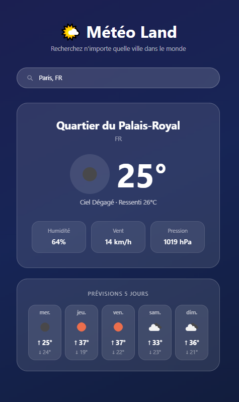

# 🌤️ Météo Land

Application météo moderne avec recherche de villes dans le monde entier, prévisions sur 5 jours, et interface glassmorphism responsive.

🔗 **Démo en ligne** : [meteo-land.vercel.app](https://meteo-land.vercel.app)



## ✨ Fonctionnalités

- 🔍 Recherche de villes avec suggestions en temps réel (gère les villes homonymes via pays/région)
- 🌡️ Météo actuelle : température, ressenti, humidité, vent, pression
- 📅 Prévisions sur 5 jours avec température min/max
- 🎨 Fond dynamique selon les conditions météo (soleil, pluie, nuit, neige...)
- 📱 Interface responsive (mobile, tablette, desktop)
- ⚡ Gestion des états de chargement et d'erreur

## 🛠️ Stack technique

- **Frontend** : React 19, Vite
- **Styling** : Tailwind CSS v4
- **API** : OpenWeatherMap (Weather + Geocoding)
- **Tests** : Vitest, React Testing Library
- **CI/CD** : GitHub Actions (lint + tests automatiques)
- **Déploiement** : Vercel

## 🚀 Lancer le projet en local

```bash
# Cloner le repo
git clone https://github.com/ansenthandrayen/meteo-land.git
cd meteo-land

# Installer les dépendances
npm install

# Créer un fichier .env à la racine avec :
# VITE_WEATHER_API_KEY=votre_clé_openweathermap

# Lancer le serveur de développement
npm run dev
```

## 🧪 Tests

```bash
npm run test:run
```

## 📂 Architecture

src/

├── components/ # Composants React réutilisables

├── services/ # Appels API (OpenWeatherMap)

├── tests/ # Tests unitaires

├── App.jsx # Composant racine

└── main.jsx # Point d'entrée

## 📝 Licence

Projet personnel à but de portfolio.
